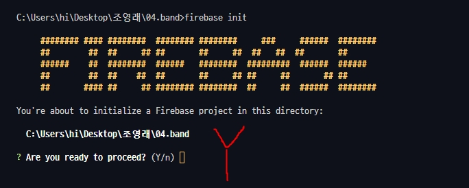

# Firebase를 이용한 웹사이트 배포

## firebase 설치 - 각PC에서 한번만 
1. [nodejs.org](https://nodejs.org)에 접속하여 **LTS**버전의 프로그램을 다운로드하고 설치한다(기본값)
2. 설치가 완료되면 nodejs프로그램에서 제공하는 **npm**(node package manager)를 사용할 수 있게 된다.
3. npm명령으로 firebase를 설치한다. (vscode의 터미널창을 열고)
```bash
npm i -g firebase-tools
```
4. 설치가 완료되면 firebase 명령을 수행할 수 있다. 그 후 사용자등록 위해 터미널 창에서 아래의 
명령을 수행하고, (Y/n)선택에서 Y를 선택하고 엔터를 하면 브라우저가 뜨면서 본인의 구글계정과 연동하게 된다.

```bash
firebase login
```

## firebase 프로젝트 만들기
### firebase.com에서 할일
1. [firebase.com](http://firebase.com)에 접속하여 구글계정으로 로그인한다.
2. 로그인 이후 우측 상단의 **콘솔로이동** 버튼을 클릭하여, 나의 콘솔로 이동한다.
3. 프로젝트 만들기(+)를 클릭하고 새로운 프로젝트를 생성한다.
- 1P: 사이트 주소 생성(신중하게)
- 2P: 애널리틱스 사용으로 체크
- 3P: 애널리틱스 사용계정(Default Account)로 선택, 혹시 국가선택이 뜨면 '대한민국'을 선택한다.
### vscode에서 할일
1. 호스팅 할 프로젝트 폴더를 연다.
2. 좀 전에 생성한 firebase 프로젝트와 본인의 프로젝트를 연동시켜야 한다.
그래서 다음과 같은 명령을 터미널창에서 수행한다.
3. 아래의 설명처럼 호스팅을 세팅한다.




4. 생성된 public 폴더에 [html, css, img, js]폴더를 이동한다.
5. 생성된 index.html 파일을 열고 아래의 내용으로 교체한다.

```html
<meta http-equiv="refresh" content="0;url=./html/index.html">
```

6. live server로 확인하여 이상이 없으면 아래의 명령을 통해 배포한다.
```bash
firebase deploy
```
